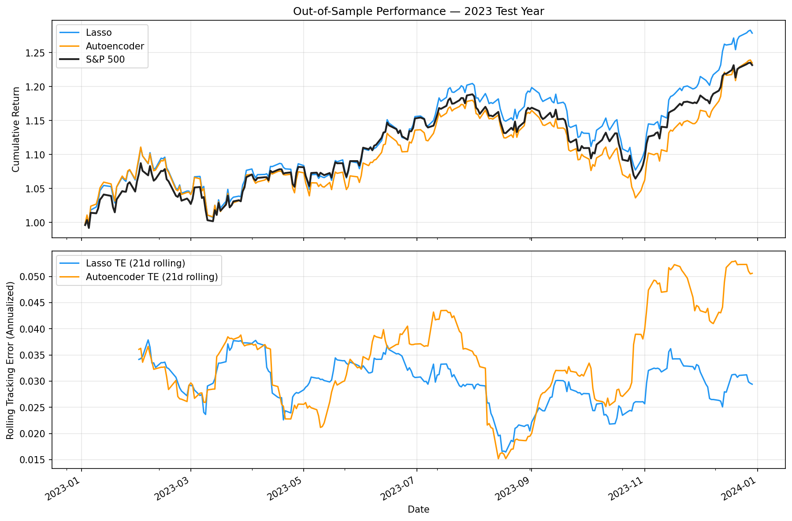
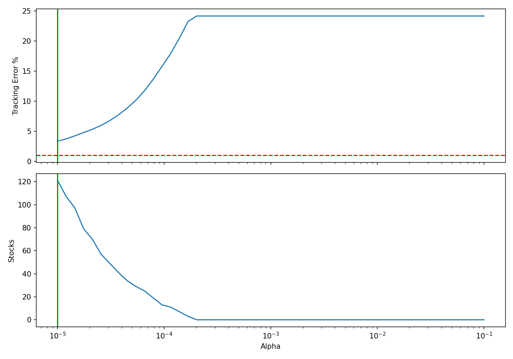
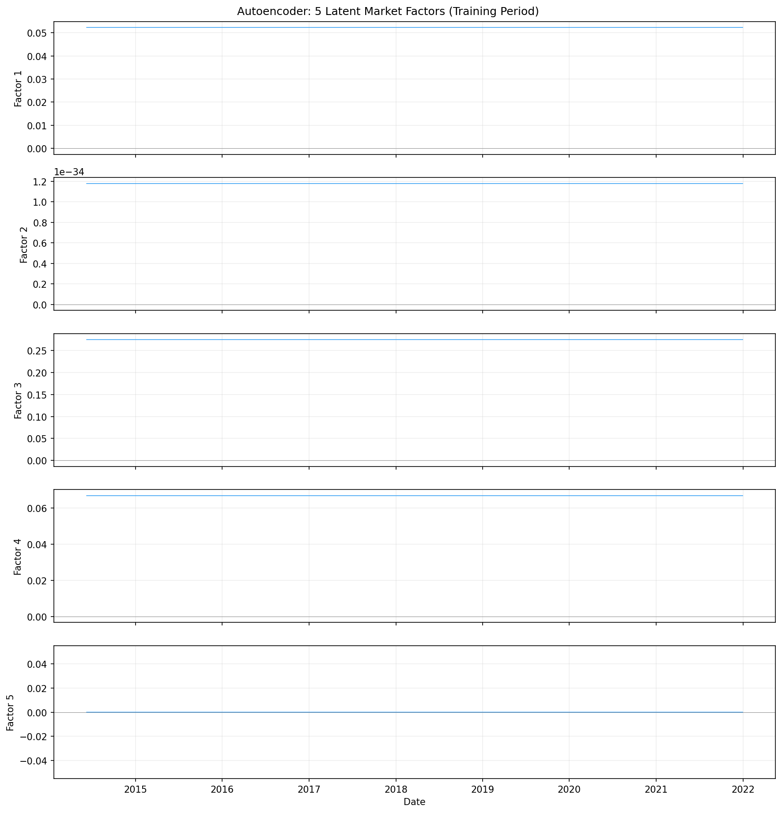

# S&P 500 Portfolio Replication — The Cloning Engine


Sparse index replication using optimization and representation learning to construct a minimal-stock portfolio that closely tracks S&P 500 performance.

> **Core research question:**  
> What is the minimum number of stocks required to acceptably replicate S&P 500 performance?

---

## Abstract

This project explores whether the S&P 500 can be replicated without holding all 500 stocks.

Three approaches were implemented and compared:

- Naive equal-weight benchmark
- Lasso regression
- Sparse autoencoder

Using 10 years of daily market data, each model was trained to identify the smallest subset of stocks capable of preserving index behavior while minimizing tracking error.

Results show that a portfolio of just **98 stocks (~20% of the index)** achieved:

- **3.025% annualized tracking error**
- **0.984 correlation** with the S&P 500
- **70% tracking-error reduction** relative to the naive benchmark

These results demonstrate that sparse replication can capture most market dynamics without requiring full index ownership.

---

## Performance Summary (2023 Out-of-Sample Test)

| Metric | Lasso Clone | Autoencoder | Naive Benchmark | S&P 500 |
|:----------------------|------------:|------------:|---------------:|--------:|
| Tracking Error | **3.025%** | 3.734% | 9.931% | 0.00% |
| Correlation | **0.9838** | 0.9702 | 0.8977 | 1.0000 |
| Max Drawdown | **-10.58%** | -12.28% | -13.37% | -10.00% |
| Stocks Used | 98 | 98 | 40 | 500 |

> Transaction costs modelled as a one-time entry cost of **10 bps** per position (5 bps commission + 5 bps slippage). Net figures reflect post-cost performance for Lasso and Autoencoder portfolios.

**Winner: Lasso**

Strongest replication quality across all major metrics.

### Key Findings

- Sparse replication reduced tracking error by ~70% relative to the naive benchmark
- Lasso outperformed the autoencoder despite being the simpler model
- Only ~20% of the index universe captured most market dynamics
- Nonlinear representation learning improved compression but not replication quality

---

## Results

### Out-of-Sample Portfolio Performance



Cumulative portfolio performance during the fully held-out 2023 test period.

---

### Lasso Regularization Path



Portfolio sparsity and tracking error as regularization strength changes.

Higher alpha:

- Fewer stocks
- Higher sparsity

Selected operating point:

- 98-stock portfolio

---

### Autoencoder Latent Factors



The 5-neuron bottleneck learns compressed representations of market co-movement.

The latent space behaves similarly to a learned nonlinear factor model.

---

## Methodology

### Data

Daily adjusted close prices were downloaded using `yfinance`.

Coverage:

- S&P 500 Index (`^GSPC`)
- Constituent stocks
- January 2014 – December 2023

Preprocessing:

- Daily log returns
- Winsorization at ±10%
- Missing data filtering (>5%)
- Batch downloads (50 stocks/request)

Train-validation-test split:

| Split | Period | Purpose |
|--------|---------|----------|
| Training | 2014–2021 | Model fitting |
| Validation | 2022 | Hyperparameter tuning |
| Test | 2023 | Final evaluation |

The test year remained completely untouched until final evaluation.

---

### Naive Benchmark

Baseline portfolio:

- Equal-weight
- Top 40 stocks ranked by average training-period return

Purpose:

Provide a sanity-check floor for replication quality.

---

### Lasso Regression

Lasso naturally performs feature selection while fitting portfolio weights.

Optimization objective:

$$ \min_{w} \left\| R_{index} - Xw \right\|_2^2 + \alpha \left\| w \right\|_1 $$

Where:
*   $R_{index}$ $\rightarrow$ S&P 500 daily returns
*   $X$ $\rightarrow$ constituent stock returns
*   $w$ $\rightarrow$ portfolio weights
*   $\alpha$ $\rightarrow$ regularization strength

Design choices:
*   Long-only constraint (`positive=True`)
*   50 log-spaced alpha values
*   Validation-based model selection

Selection criterion:
> Find the sparsest portfolio satisfying validation tracking error constraints.

Final output: **98-stock sparse portfolio**

---

### Sparse Autoencoder

Architecture:

```
~500 Stock Returns
        ↓
Dense(64, ReLU)
        ↓
Bottleneck(5, ReLU)
        ↓
Sparse Output(98 Stocks)
```

Design choices:

- 5 latent factors
- Sparse output masking
- Portfolio-return MSE objective
- Restricted output universe (Lasso-selected stocks)

The masking layer prevents information leakage through all 500 stocks.

Training directly optimized replication quality rather than reconstruction quality.

---

### Why Two Models?

The approaches represent different philosophies.

| Model | Philosophy |
|--------|------------|
| Lasso | Sparse linear optimization |
| Autoencoder | Nonlinear representation learning |

The comparison evaluates whether representation learning improves sparse index replication.

---

## Repository Structure

```text
sp500-portfolio-clone/

├── data/
│   ├── raw/
│   └── processed/
│
├── models/
├── notebooks/
│
├── results/
│   ├── backtest_comparison.png
│   ├── latent_factors.png
│   └── regularization_path.png
│
├── src/
│   ├── data_pipeline.py
│   ├── lasso_model.py
│   ├── autoencoder.py
│   └── backtest.py
│
├── requirements.txt
├── README.md
└── main.py
```

---

## Installation

Clone repository:

```bash
git clone https://github.com/UnEthicalMK/sp500-portfolio-clone.git

cd sp500-portfolio-clone
```

Create environment:

```bash
python -m venv venv
```

Activate:

Linux/macOS:

```bash
source venv/bin/activate
```

Windows:

```bash
venv\Scripts\activate
```

Install dependencies:

```bash
pip install -r requirements.txt
```

Run:

```bash
python main.py
```


---

## Dependencies

```
yfinance==0.2.40
pandas==2.2.2
numpy==1.26.4
scikit-learn==1.5.1
torch==2.3.1
matplotlib==3.9.0
seaborn==0.13.2
jupyter==1.0.0
tqdm==4.66.4
```

Python:

```
3.10+
```

---

## Limitations

- Survivorship bias from current constituent membership
- Static portfolio weights
- Transaction costs modelled as a simplified one-time entry (10 bps); ongoing rebalancing costs not captured
- Non-institutional market data (`yfinance`)

---

## Future Work

- Historical constituent integration
- Dynamic rebalancing
- Transaction-cost-aware optimization
- Information ratio optimization


---

## Disclaimer

This repository is intended solely for research and educational purposes.

It does not constitute investment advice or portfolio management guidance.
